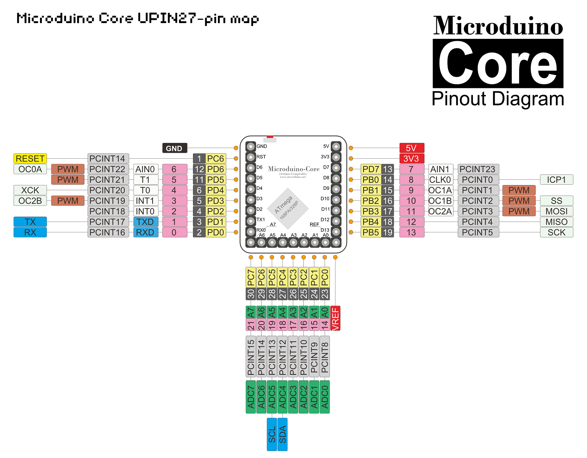
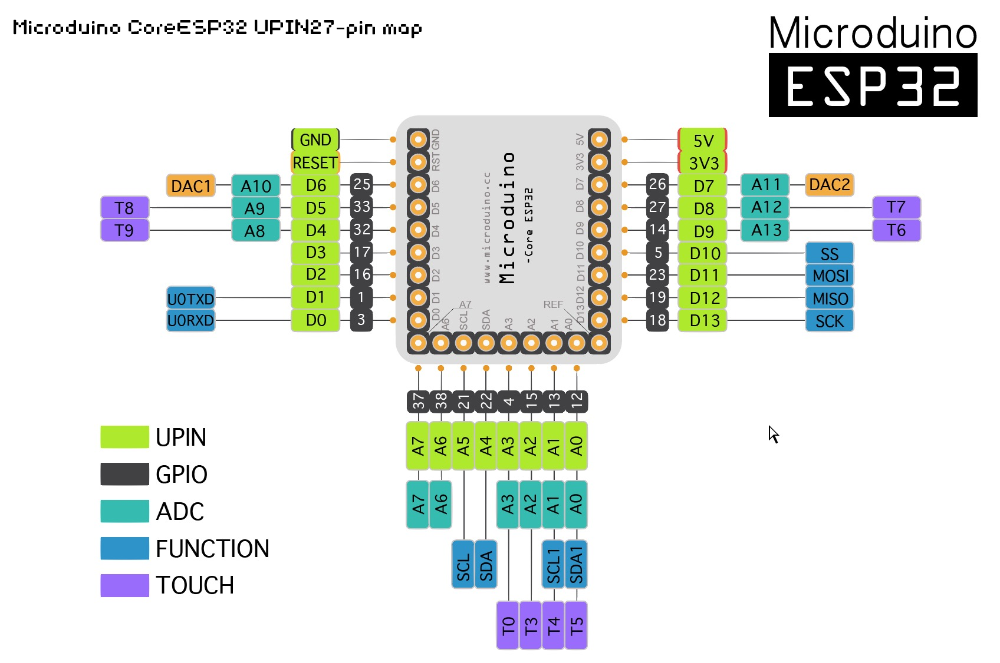

Microduino-IDE  
========

Release:
------------
- **Latest:**
    - https://github.com/wasdpkj/Microduino-IDE-Support/releases/latest

Readme:
------------
- 2017-07-14：
  - Library进行了一次大更新，可能会和之前的程序有不兼容
  - 如需下载更新前的老版本，可去OLD分支下载：[OLD-Download](https://github.com/wasdpkj/Microduino-IDE-Support/tree/OLD)
  - The libraries have been updated greatly and the new ones maybe incompatible with the previous programs.
  - To download the old version before the update, please go to OLD branch：[OLD-Download](https://github.com/wasdpkj/Microduino-IDE-Support/tree/OLD)
- We do a lot of work related to the libraries for better support of Microduino and mCookie Modules
- The libraries are not included in the support package, so you need to install the support package and the libraries separately
- 我们为了让Microduino和mCookie模块的库更好使用，做了很多工作
- 支持包中未包含库，你需要分别安装支持包和库

How to add the support package for Microduino：
------------
- Add the URL for the package to "File>Preferences>Additional Boards Manager URLs
  - URL:https://github.com/wasdpkj/Microduino-IDE-Support/raw/master/package_Microduino_index.json
- Tools>Board>Boards Manager...
- Select the board and the latest version you want to install
  - "Microduino AVR Boards"
  - "Microduino ESP32 Boards"
- Wait for it to download completely
- Close Boards Manager
- Select the board at "Tools>Board"
  - "Microduino/mCookie-device"
  - "Microduino CoreESP32"

How to add the libraries for Microduino：
------------
- Clone this project or Download: [Microduino-IDE-Support-master.zip](https://github.com/wasdpkj/Microduino-IDE-Support/archive/master.zip)
- We recommend: first clear the Arduino installation directory libraries folder, to prevent the conflict between libraries: 
  - For example Servo, we have modified the code to support more cores
- Copy the libraries folder to the Arduino installation directory

Website:
------------
- [Microduino EN](http://www.microduino.cc)
- [Microduino CN](http://www.microduino.cn)

- [Microduino wiki EN](http://wiki.microduino.cc)
- [Microduino wiki CN](http://wiki.microduino.cn)

- E-mail:
  - Kejia Pan
  + pankejia@microduino.cc

- Weibo:
  - @老潘orz

Core Pinmap:
------------

